<div align="center">

<picture>
  <source media="(prefers-color-scheme: dark)" srcset="docs/img/banner-dark.svg">
  <source media="(prefers-color-scheme: light)" srcset="docs/img/banner-light.svg">
  
</picture>

[](https://github.com/jcaparr/Web-hamburgueseria/actions/workflows/ci.yml)


</div>

**Burgómetro** es una web para descubrir, calificar y reseñar las hamburgueserías de Buenos Aires: más de 1.500 locales de CABA y del conurbano, cargados desde Google Places.

## Qué se puede hacer

- **Explorar** los locales filtrando por uno o varios barrios, con la opción de esconder las cadenas de comida rápida.
- **Ver la ficha de cada local:** fotos, horario, distribución de notas, de qué hablan las reseñas y otras hamburgueserías del barrio.
- **Calificar y reseñar**, con foto.
- **Ranking** de las mejor puntuadas.
- **Wishlist** con las que tenés pendientes.
- **Tour:** arma un recorrido a pie con las paradas y los kilómetros que elijas, por barrio o desde donde estás, y lo abre en Google Maps.
- **Social:** perfiles públicos, seguir gente, un feed con sus reseñas y bloquear cuentas.
- **Cuentas:** registro con verificación por email, recuperación de contraseña e ingreso con Google.

## Stack

<picture>
  <source media="(prefers-color-scheme: dark)" srcset="docs/img/stack-dark.svg">
  <source media="(prefers-color-scheme: light)" srcset="docs/img/stack-light.svg">
  
</picture>

| | |
|---|---|
| **Backend** | Java 17 · Spring Boot 4 · Spring Security · Spring Data JPA · Flyway · JJWT |
| **Base de datos** | PostgreSQL 17 (H2 en los tests) |
| **Frontend** | React 19 · TypeScript · Vite · React Router · Tailwind CSS · daisyUI |
| **Infra** | Docker Compose · Caddy · GitHub Actions · Dependabot |
| **APIs externas** | Google Places · Google Identity Services |

## Arquitectura

Todo corre en un solo servidor con Docker Compose. Caddy es la única puerta de entrada: sirve el frontend, hace de proxy a `/api` y consigue y renueva el certificado HTTPS solo. Ni el backend ni la base publican puertos.

```
internet ──▶ caddy :80/:443 ──┬──▶ /api/*  ──▶ backend :8080 ──▶ db :5432
                              └──▶ resto   ──▶ archivos estáticos del frontend
```

## Decisiones técnicas

- **Sesiones en cookies HttpOnly.** El access token dura 15 minutos y el refresh token 30 días. Como el sitio y la API comparten origen, la cookie no necesita excepciones de CORS.
- **Ingreso con Google sin client secret.** El backend valida el ID token con la librería oficial (firma, emisor, audiencia y vencimiento) en lugar de hacerlo a mano.
- **Rate limiting con token bucket** en los endpoints de autenticación. Vive en memoria porque la app corre en una sola instancia; el código documenta cuándo habría que pasarlo a Redis.
- **Headers de seguridad** en Caddy: CSP estricta, HSTS y Permissions-Policy. Las tipografías se sirven desde el propio sitio, así que quien solo mira no toca ningún servidor de terceros.
- **Sincronización con Google Places por trabajos separados:** el barrido de zonas, la limpieza, las fotos y los horarios corren por separado porque cuestan muy distinto en cuota. Toda llamada pasa por un único punto que la espacia y la anota contra los límites mensuales.
- **Feed con paginación por cursor** (instante + id) en lugar de una tabla de feed: se arma al momento y no puede saltear ni repetir reseñas entre páginas.
- **Flyway es dueño del esquema** y Hibernate solo valida que las entidades coincidan.
- **CI que de verdad evalúa a Dependabot:** cada PR compila y corre los tests del backend, y hace lint y build del frontend. Un salto de versión que no compila queda en rojo antes de mergearlo.
- **Backups** de la base y de las fotos con un script para cron, retención de 14 días y copia fuera del servidor con rclone.

## Correrlo en local

Hace falta Java 17, Maven, Node 22 y Docker.

```bash
# 1. Base de datos (Postgres 17)
docker compose up -d

# 2. Backend en http://localhost:8080 (perfil dev, Flyway crea el esquema)
cd backend
mvn spring-boot:run

# 3. Frontend en http://localhost:5173
cd frontend
cp .env.example .env
npm ci
npm run dev
```

Sin SMTP configurado, los códigos de verificación se escriben en el log del backend. Para traer locales de Google hace falta `GOOGLE_MAPS_API_KEY` y `PLACES_SYNC_ENABLED=true`.

## Tests

```bash
cd backend
mvn verify
```

Son 46 clases de test que corren sobre H2 y sin salida a internet.

## Deploy

El paso a paso para producción (dominio, HTTPS, email, ingreso con Google y backups) está en [`deploy/README.md`](deploy/README.md).

---

<div align="center">
<sub>Hecho por <a href="https://github.com/jcaparr">Juan Martín Caparrós</a> en Buenos Aires 🍔</sub>
</div>
